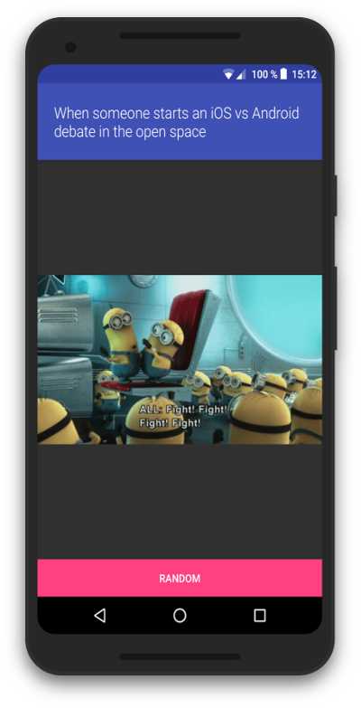

# SAM-Java

The SAM (State-Action-Model) pattern in Java.

SAM is an application architecture pattern first [introduced by Jean-Jacques Dubray](http://sam.js.org). The principles of the pattern are, in turn, based on TLA+ (Temporal Logic of Actions), developed by [Leslie Lamport](https://www.microsoft.com/en-us/research/people/lamport/).

This project is inspired on [SAM-Swift](https://github.com/fe9lix/SAM-Swift) and is a proof of concept on how the pattern can be applied on Android.

This implementation simplifies the plumbing between the different SAM components by using old-school callbacks. A real-world implementation would replace these with more modern technologies such as Databiding, Rx or whatever the young kids are using these days.

Other software engineering best practices are also ignored here in favour of making the project as unopinionated as possible, and to not detract from the core of that the SAM pattern represents.

## More information on the SAM pattern

* [SAM Website](http://sam.js.org)
* [SAM-Swift](https://github.com/fe9lix/SAM-Swift)

## About the App

The app loads and displays a random gifs from [The Coding Love](http://thecodinglove.com). As stated above, the code is kept as simple as possible in order to focus on the pattern implementation, and therefore shies away from using other modern frameworks of patterns.

